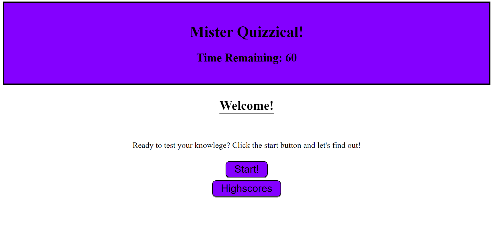

# Mister Quizzical

## Purpose
Creates a timed quiz in which the remaining time is the highscore which is saved to a scoreboard. Wrong answers deduct time so the user needs to be quick and accurate in their answers!

## Built With
* HTML
* CSS
* JavaScript (web APIs)

## Screenshot

## Website
https://vrentadax.github.io/mister-quizzical/

## Contribution
Made with ❤️ by Dax
